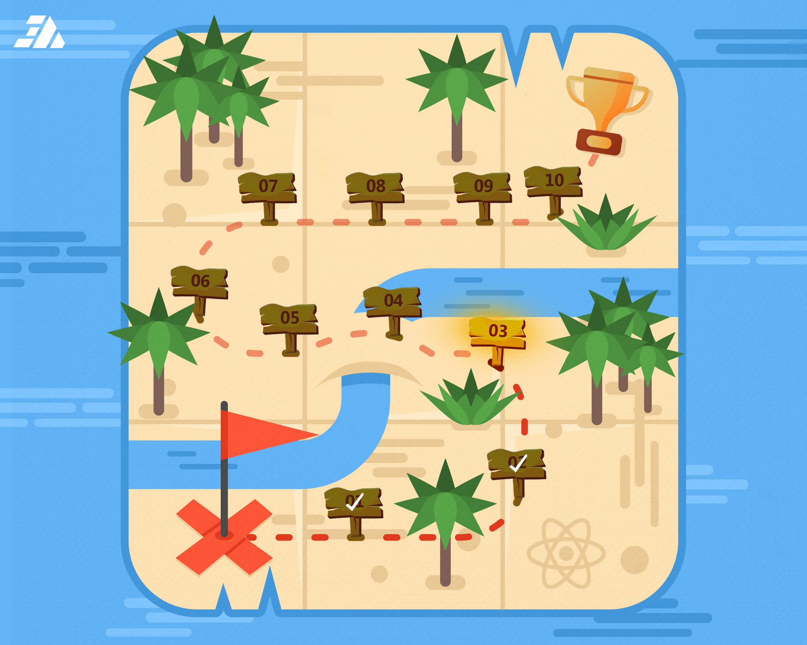
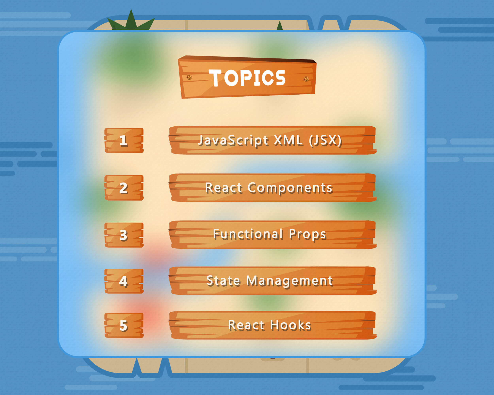

<h1 align="center">Session 3: Step Ahead 🏗️</h1>




<p align="center">In this section, you’ll learn key React concepts like JSX, Components, Props, State, and Hooks. These topics are the foundation of building powerful and interactive React apps. 🚀</p>

---

### Session Topics

- **[JavaScript XML (JSX)](#javascript-xml-jsx)**

  - [HTML-like Syntax](#html-like-syntax)
  - [JavaScript Expressions](#javascript-expressions)
  - [Inline Styles](#inline-styles)
  - [Attributes & Props (camelCase)](#attributes--props-camelcase)
  - [Must Be Wrapped (Fragments or Parent Elements)](#must-be-wrapped-fragments-or-parent-elements)

- **[React Components](#react-components)**

- **[Functional Props](#functional-props)**

- **[State Management](#state-management)**

- **[React Hooks](#react-hooks)**

  - **[useState](#usestate)**
  - **[useEffect](#useeffect)**

- **[💡 Client Task](#client-task)**

---

### JavaScript XML (JSX)

   <p>JSX is a syntax extension for JavaScript, commonly used with React, that allows writing HTML-like code inside JavaScript. JSX makes it easier to structure UI components while maintaining the full power of JavaScript.</p>

1. #### HTML-like Syntax

   JSX looks `similar to HTML` but is `written inside JavaScript`.

   ```bash
   function App() {
    return (
      <div>
        <h1>Hello, World!</h1>
        <p>This is JSX syntax.</p>
      </div>
    );
   }
   ```

   ***

2. #### JavaScript Expressions

   JavaScript expressions can be embedded inside `{}`.

   ```bash
   function App() {
    const name = "Ahmed";
    const age = 28;
    return (
      <div>
        <p>Name: {name}</p>
        <p>Next year: {age + 1}</p>
      </div>
    );
   }
   ```

   ***

3. #### Inline Styles

   Inline styles in React are a way to apply CSS directly to elements using a JavaScript object. These styles are written in camelCase format and passed to the style attribute as an object inside JSX.

   ```bash
   function Button() {

     const style = {
       backgroundColor: 'blue',
       color: 'white',
       padding: '10px 20px',
       borderRadius: '5px',
     };

     return <button style={style}>Click Me</button>;
   }
   ```

   ***

4. #### Attributes & Props (camelCase)

   JSX attributes are written in `camelCase` (e.g., `className` instead of `class`).

   ```bash
   function App() {
    return <button className="btn-primary" onClick={() => alert("Clicked!")}>Click Me</button>;
   }
   ```

   ***

5. #### Must Be Wrapped (Fragments or Parent Elements)

   JSX must return a `single` parent element.

   1. ##### ✅ Correct (Using `<div>`)

      ```bash
      function App() {
        return (
          <div>
            <h1>Title</h1>
            <p>Description</p>
          </div>
        );
      }
      ```

      ***

   2. ##### ✅ Correct (Using Fragments `<>...</>`)

      ```bash
      function App() {
        return (
          <>
            <h1>Title</h1>
            <p>Description</p>
          </>
        );
      }
      ```

---

### React Components

  <p>A React component is a reusable, self-contained unit of a React application that defines how a part of the user interface (UI) should appear and behave. Components can be functional or class-based.</p>

```bash
function Greeting() {

  const name = "Ahmed";

  return <h1>Hello, {name}!</h1>;
}
```

---

### Functional Props

<p>Functional Props refer to props in React that are functions. Instead of passing static values, functional props allow components to receive and execute functions, enabling dynamic behavior, event handling, and component communication.</p>

```bash
// React component returns a product card:

const ProductCard = ({ product }) => {
  return (
    <div>
      
      <h3>{product.name}</h3>
      <p>{product.price}</p>
    </div>
  );
};


// React root func:

const App = () => {
  const sampleProduct = {
    image: "https://via.placeholder.com/100",
    name: "Smartphone",
    price: 299
  };

  return <ProductCard product={sampleProduct} />;
};
```

---

### State Management

<p>State Management refers to the practice of handling the state (data) of an application in a predictable and efficient way. It involves tracking, updating, and synchronizing the state across different components to ensure a smooth user experience.</p>

1. #### Local State

   Managed within a single component using hooks like `useState` (React)

   ***

2. #### Global State
   Shared across multiple components, often managed using tools like `Redux`, `Context API`

---

### React Hooks

React Hooks are functions that let you use state and lifecycle features in functional components, eliminating the need for class components. `Introduced in React 16.8`, hooks simplify state management, side effects, and other React features.

1.  #### useState

    is a React Hook that allows you to add state to functional components. It lets you store and update values over time, like user input, toggles, or counters.

    Syntax:

    ```bash
    const [state, setState] = useState(initialValue);
    ```

    - `state`: The current value.
    - `setState`: A function used to update the value.

    ***

2.  #### useEffect

    Imagine you're building a component like a "To-Do List" or a "Timer". Sometimes, you need your component to do something after it appears on the screen, like:

    - Getting data from a server
    - Changing the page title
    - Starting a countdown

    Syntax:

    ```bash
    useEffect(() => {

    }, []);
    ```

    You can think of it like this:

    💬 “Hey React, after rendering this component, please run this code.”

    ***

> [!TIP]
> React Hooks were `introduced in React 16.8` to allow function components to use state and other React features that were previously only available in `class components`.

<br>

---

<a id="client-task"></a>

### 💡 Client Task

```bash
Basic Task Tracker for a Personal Productivity App
Client: Tom, a freelancer who needs a simple task tracker to jot down daily tasks while working.

🎯 Project Brief:
Tom needs a lightweight and easy-to-use Task Tracker for jotting down daily tasks. The app should be simple, fast, and distraction free allowing him to quickly add tasks and view them in a list.

📌 Client Request:
1️⃣ Type a task in an input field.
2️⃣ Click a button to add it to the list.
3️⃣ See the list of tasks displayed on the screen.

Tom will use this feature in a personal productivity app where he tracks small tasks throughout the day.
```

### 💻 Solution

```bash
import { useState } from "react";

const TaskList = () => {
  const [tasks, setTasks] = useState([]); // Stores tasks
  const [taskInput, setTaskInput] = useState(""); // Stores input value

  // Function to add a new task
  const addTask = () => {
    if (taskInput === "") return; // Prevent empty tasks
    setTasks([...tasks, taskInput]); // Add task to list
    setTaskInput(""); // Clear input field
  };

  return (
    <div>
      <h2>📌 My Task Tracker</h2>

      {/* Input Field */}
      <input
        type="text"
        value={taskInput}
        onChange={(e) => setTaskInput(e.target.value)}
        placeholder="Enter a task..."
      />
      <button onClick={addTask}>Add Task</button>

      {/* Task List */}
      <ul>
        {tasks.map((task, index) => (
          <li key={index}>{task}</li> // Display tasks
        ))}
      </ul>
    </div>
  );
};

export default TaskList;
```

---

<div align="center">
<a href="#" >NEXT SESSION ></a>
</div>

---
