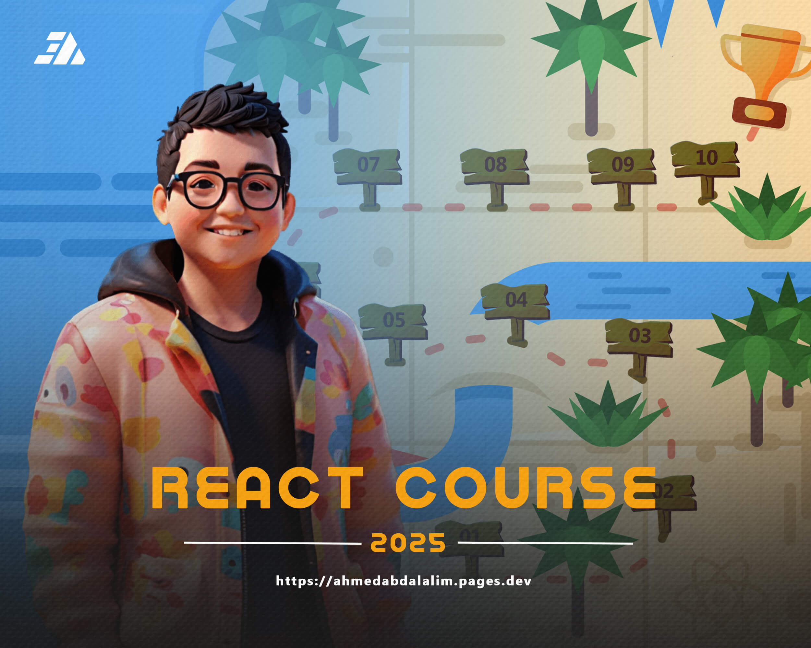

<h1 align="center">⚛️ React Course Repository</h1>

Welcome to the React Course Repository! 🚀 This repository contains all the essential code, links used, and projects covered in the React-Course.

---

### Tools

    

---

### Programming Language

    

---

### Course Sessions

- #### [Session 1: React Introduction](https://github.com/ahmed-abd-alalim/React-Course/tree/session-1-react-introduction)

- #### [Session 2: Initial Steps](https://github.com/ahmed-abd-alalim/React-Course/tree/session-2-initial-steps)

- #### [Session 3: Steps Ahead](https://github.com/ahmed-abd-alalim/React-Course/tree/session-3-steps-ahead)
  
- #### [Session 4: Fourth Spark](https://github.com/ahmed-abd-alalim/React-Course/tree/session-4-fourth-spark)
  
- #### [Session 5: Coming Soon](https://github.com/ahmed-abd-alalim/React-Course)

---

### Contact
 
 

   
 
 

---
 
### License

This program has been licensed under the MIT License. If you are a true FOSS (Free And Open Source Software) Lover, you wont customize this and redistribute this under your name
