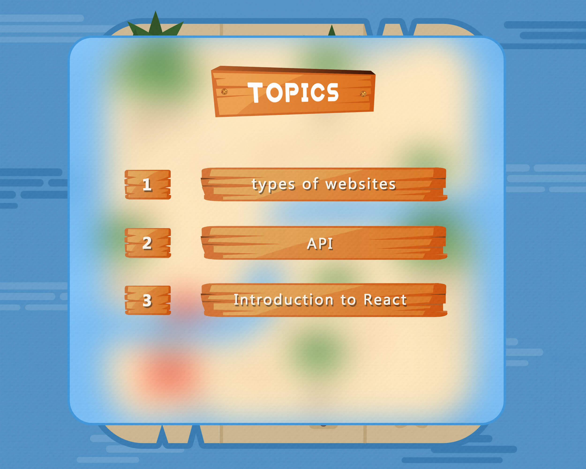
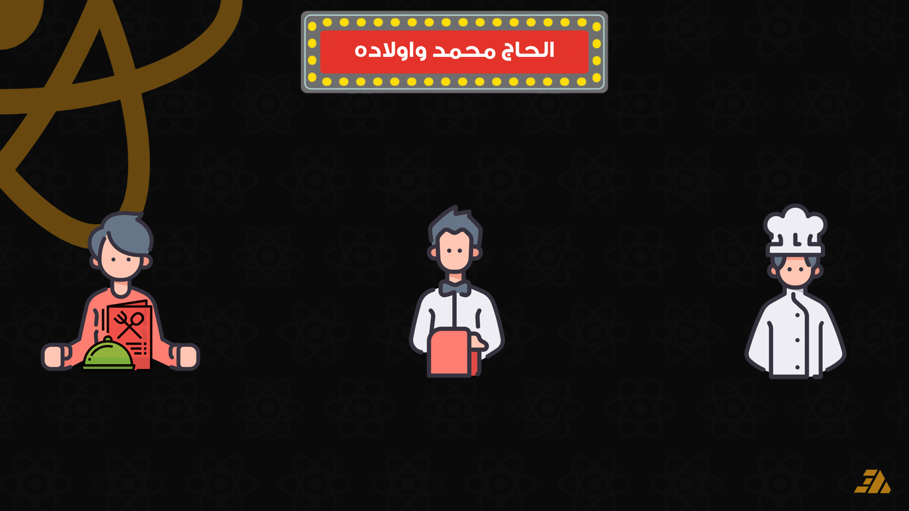

<h1 align="center">Session 1: Introduction to React 🚀</h1>

This section provides an Introduction to React, covering key concepts like Types of Websites (Static, SSR, and CSR), APIs (how they work with examples), and React fundamentals such as Rendering and React DOM. A screenshot from the session’s PowerPoint is included for reference.

---

### Session Topics

- [Types of Websites](#types-of-websites)

  - [Static Website](#static-website)
  - [Server-side Rendering (SSR)](#server-side-rendering-ssr)
  - [Client-side Rendering (CSR)](#client-side-rendering-csr)

- [Application Programming Interfaces (API)](#application-programming-interfaces-api)

  - [Example](#example)
  - [How API work](#how-api-work)

- [React](#react)
  - [Introduction to React](#Introduction-to-react)
  - [Render](#render)
  - [React DOM](#react-dom)

---

### Types of Websites

1. #### Static Website

   

2. #### Server-side Rendering (SSR)

   ")
   ")
   ")

3. #### Client-side Rendering (CSR)
   ")
   ")
   ")
   ")
   ")

---

### Application Programming Interfaces (API)

1. #### Example

   

2. #### How API work
   
   
   
   

---

### React

1. #### Introduction to React

   
   ")
   

2. #### Render

   

3. #### React DOM

   
   
   

 
 

---

 
<a href="https://github.com/ahmed-abd-alalim/React-Course/tree/session-2-initial-steps" >NEXT SESSION ></a>

---
